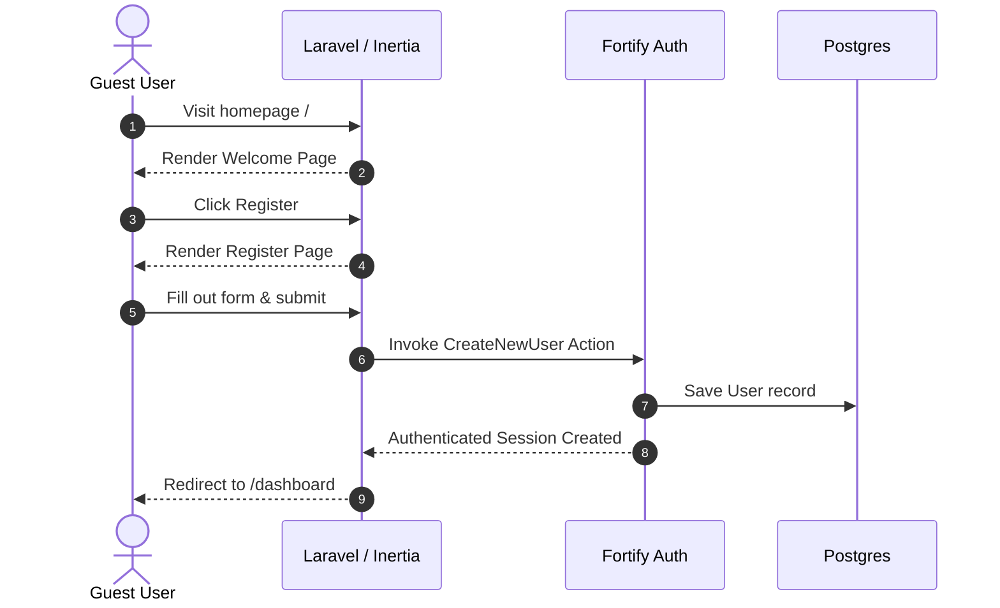
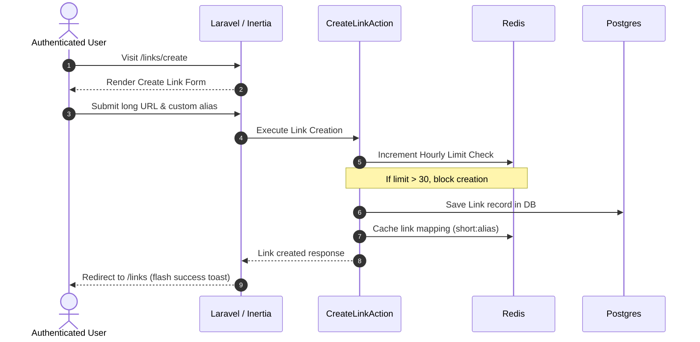
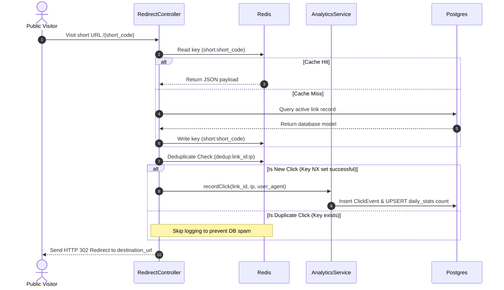

# SingkatSaja — Complete System Technical Explanation

This document serves as the absolute technical reference for the SingkatSaja application. It is structured to provide an in-depth understanding of the system's architecture, technologies, data flow, optimizations, and deployment models for maintainers, architects, and presenters.

---

## 1. Executive Summary

### What is SingkatSaja?
SingkatSaja is a production-ready, self-hostable URL shortener and click analytics application built on top of Laravel, React, Inertia.js, PostgreSQL, and Redis. It provides rapid URL shortening, cached redirection resolution, device/browser analytics extraction, and automated security safeguards.

### The Problem It Solves
Modern digital distribution requires sharing clean, brief, and branded links. Standard destination URLs are often excessively long, loaded with tracking parameters, and fragile. SingkatSaja solves three core problems:
1. **Link Optimization:** Transforming long URLs into short, aesthetic codes.
2. **Access Telemetry:** Recording visitor user-agents, referers, and time-series data to understand audience demographics.
3. **Infrastructure Cost & Complexity:** Delivering sub-millisecond redirect lookups while running efficiently on free-tier, serverless hosting (Vercel and Neon/Upstash).

### Intended Users
* **Solo Developers & Small Teams:** Seeking a free-tier compatible, self-hosted shortcut system.
* **Content Marketers:** Requiring clean links and basic access aggregate charts.
* **Academic Presenters:** Developers studying modern full-stack integrations (Laravel + Inertia + React) for educational benchmarks.

---

## 2. High-Level Architecture

SingkatSaja utilizes a hybrid caching layout designed to shield the relational database from redirection traffic while maintaining real-time statistics.

### Overall System Architecture

```
                                +-------------------+
                                |   Web Browser /   |
                                |  Public Visitor   |
                                +---------+---------+
                                          |
                                          | HTTP Redirect / API Request
                                          v
                                +---------+---------+
                                |  Vercel SSL Proxy |
                                +---------+---------+
                                          |
                                          | (Terminates SSL)
                                          v
                               +----------+----------+
                               | Laravel App Lambda  |
                               +----------+----------+
                                          |
                     +--------------------+---------------------+
                     | (Redirection Cache Check)                | (DB Write / Query)
                     v                                          v
           +---------+---------+                      +---------+---------+
           |   Upstash Redis   |                      |  Neon PostgreSQL  |
           +-------------------+                      +-------------------+
```

### Request Flow (Visitor Redirection)

```
[Visitor] -> (Request /{short_code}) -> [Laravel App]
                                             |
                                             v
                                  Check Redis Cache (short:{code})
                                  /                              \
                           [Cache Hit]                       [Cache Miss]
                               |                                  |
                               v                                  v
                    Parse cached JSON payload              Fetch from Postgres
                               |                                  |
                               |                           Rebuild Redis Cache
                               v                                  v
                    Verify Link Expiration <----------------------+
                               |
                        [Deduplication check (Redis dedup key)]
                               |
                         /           \
                 [Already seen]     [New Click]
                      /                  \
                     /                    v
                    /              Record click via AnalyticsService
                   /               (Sync DB transaction & UPSERT)
                  /                      |
                  v                      v
        Send HTTP 302 Redirect to destination_url
```

---

## 3. Tech Stack Explanation

| Technology | Purpose | Chosen Justification | Inter-component Interaction |
| :--- | :--- | :--- | :--- |
| **Laravel 11** | Backend Framework | Core business logic, secure routing, ORM (Eloquent), dependency injection, and Fortify integration. | Handles all HTTP traffic, contacts Redis, manages DB migrations, and resolves page components through Inertia. |
| **PostgreSQL 17** | Relational Database | Relational integrity, native `INET` IP type, composite primary/unique keys, and support for partial unique indexes. | Receives clicks data, holds user/link records, and executes daily aggregate upsert operations. |
| **Redis** | In-Memory Database | Cache storage, atomic counters (`INCR`), expiration timers (`TTL`), and sub-millisecond data reads. | Caches short link data, tracks creation rate-limits, and evaluates click deduplication windows. |
| **Inertia.js** | Full-Stack Glue | Bypasses the need for REST APIs or client-side routers; handles hydration and layout rendering directly from controllers. | Glues Laravel controller responses directly to React features without loading full browser pages. |
| **React 19** | Frontend UI | Declarative, component-based rendering, rich visual ecosystems, and hydration support. | Serves as the interactive dashboard frontend, reading Inertia props and updating form state. |
| **TypeScript** | Static Typing | Safety across frontend states, form variables, and generated backend route interfaces. | Configured via `tsconfig.json` to ensure code safety across layouts, components, and pages. |
| **Tailwind CSS v4** | Styling Utilities | Quick design tokens implementation, glassmorphism aesthetics, dark mode variance, and minimal bundle sizes. | Injected in `app.css` to style responsive layout wrappers, buttons, and responsive grid patterns. |
| **Vite 8** | Frontend Asset Bundling | Fast compile runs, Hot Module Replacement (HMR) locally, and modern asset bundling for production. | Orchestrates compilation of TSX/CSS assets and triggers the Wayfinder route types generation command. |
| **Docker** | Isolation & Compose | Standardizes database and cache runtimes locally, guaranteeing consistent dev/test parameters. | Orchestrates Postgres and Redis containers in local development via `docker-compose.yml`. |
| **Vercel** | Serverless Hosting | Auto-scaling serverless lambda execution, built-in global CDN, and zero-cost Hobby tier. | Hosts the application files, terminates SSL, and forwards requests to the serverless PHP environment. |
| **Fortify** | Headless Authentication | Standardized user registration, profile updates, two-factor authentication, and password reset rules. | Exposes secure authentication endpoints, invoked by the dashboard settings and login controllers. |
| **Pest** | Testing Framework | Minimalist, expressive test grammar, rapid setup, and seamless integration with Laravel database test states. | Tests link lifespan validations, rate limits, page layouts, database models, and click aggregates. |

---

## 4. Complete Folder Structure Walkthrough

* **`app/`**
  * **Responsibility:** Contains the core PHP classes (Controllers, Actions, Models, Services, Policies, Providers).
  * **Key Files:** 
    * `app/Http/Controllers/RedirectController.php` — Directs visitors to target links.
    * `app/Services/AnalyticsService.php` — Directs transactional clicks to Postgres.
* **`bootstrap/`**
  * **Responsibility:** Binds system setup variables and exposes the application configurations.
  * **Key Files:** `bootstrap/app.php` — Registers middleware, sets up routing files, and configures proxy headers.
* **`config/`**
  * **Responsibility:** File configurations for cache, database, queues, mail, and application specific thresholds.
  * **Key Files:** `config/singkatsaja.php` — Holds reserved aliases and rate limit constants.
* **`database/`**
  * **Responsibility:** Manages relational migrations, database seeders, and factories for testing.
  * **Key Files:** `database/migrations/2026_06_08_000000_create_links_table.php` — Links schema definition.
* **`public/`**
  * **Responsibility:** Root directory served publicly by web servers (contains favicons, logos, and Vite built assets).
  * **Key Files:** `public/favicon.svg` — Serves as the system logo icon.
* **`resources/`**
  * **Responsibility:** Raw frontend source files (CSS layouts, React features, and blade view entry points).
  * **Key Files:** `resources/views/app.blade.php` — The baseline HTML framework containing Inertia configurations.
* **`routes/`**
  * **Responsibility:** Exposes URL endpoints to controllers.
  * **Key Files:** `routes/web.php` — Dashboard and visitor redirection endpoints.
* **`tests/`**
  * **Responsibility:** Verification files containing unit and feature test assertions.
  * **Key Files:** `tests/Feature/AbuseProtectionTest.php` — Confirms rate limits and deduplication safety.
* **`deployment/`**
  * **Responsibility:** Holds deployment artifacts and environments setups.
  * **Key Files:** `deployment/docker/Dockerfile` — Container runtime specification.
* **`docs/`**
  * **Responsibility:** Hosts documentation, system design specifications, ERD, and visual presentation assets.

---

## 5. Backend Deep Dive

### Reorganized Action Classes (`app/Actions/`)

Laravel Actions isolate a single business transaction into a discrete class, enhancing testability and discoverability.

#### Domain: Link (`app/Actions/Link/`)
* **`CreateLinkAction.php`**
  * **Purpose:** Saves a new URL, checks aliases, caches to Redis, and increments the rate limit.
  * **Inputs:** `User $user, array $data` (destination_url, optional custom short_code, optional expires_at).
  * **Outputs:** `Link` (hydrated model record).
  * **Dependencies:** `GenerateShortCodeAction`.
* **`DeleteLinkAction.php`**
  * **Purpose:** Soft-deletes a Link record and clears the Redis cache.
  * **Inputs:** `Link $link`.
  * **Outputs:** `void`.
* **`GenerateShortCodeAction.php`**
  * **Purpose:** Generates a unique 7-character base62 string, checking reserved keywords and collisions.
  * **Outputs:** `string` (unique short code).
* **`GetLinksAction.php`**
  * **Purpose:** Queries and returns paginated list of links for a user with sorting metrics.
  * **Inputs:** `User $user, array $filters` (sort, per_page).
  * **Outputs:** `LengthAwarePaginator`.
* **`UpdateLinkAction.php`**
  * **Purpose:** Modifies destination/expiry dates and updates the Redis cache.
  * **Inputs:** `Link $link, array $data`.
  * **Outputs:** `Link`.
* **`ResolveShortCodeAction.php`**
  * **Purpose:** Looks up the short code in Redis, falling back to PostgreSQL and rebuilding cache on miss.
  * **Inputs:** `string $shortCode`.
  * **Outputs:** `?Link`.

#### Domain: Analytics (`app/Actions/Analytics/`)
* **`GetLinkAnalyticsAction.php`**
  * **Purpose:** Gathers aggregated stats (clicks over 7/30 days, top browsers, platforms, devices) for a link.
  * **Inputs:** `Link $link`.
  * **Outputs:** `array` (analytics payload).

#### Domain: Dashboard (`app/Actions/Dashboard/`)
* **`GetDashboardStatsAction.php`**
  * **Purpose:** Calculates user metrics (total links, active links, total clicks, clicks today) for dashboard summary.
  * **Inputs:** `User $user`.
  * **Outputs:** `array` (dashboard statistics).

#### Domain: Auth (`app/Actions/Auth/`)
* **`CreateNewUser.php`**
  * **Purpose:** Handles user registration validations and saves new User records.
  * **Inputs:** `array $input` (name, email, password).
  * **Outputs:** `User`.
* **`ResetUserPassword.php`**
  * **Purpose:** Validates and executes user password reset logic.
  * **Inputs:** `User $user, array $input`.

---

## 6. Database Deep Dive

```
  +------------------+             +--------------------+
  |      users       |             |      passkeys      |
  +------------------+             +--------------------+
  | id (PK)          |<-----------+| id (PK)            |
  | name             |             | user_id (FK)       |
  | email            |             | name               |
  | password         |             | credential_id      |
  | timestamps       |             | credential (JSON)  |
  +--------+---------+             +--------------------+
           |
           | 1
           |
           | 0..*
           v
  +--------+---------+             +--------------------+
  |      links       |             |    daily_stats     |
  +------------------+             +--------------------+
  | id (PK)          |<-----------+| id (PK)            |
  | user_id (FK)     |             | link_id (FK)       |
  | short_code       |             | date               |
  | destination_url  |             | clicks_count       |
  | expires_at       |             +---------+----------+
  | deleted_at       |                       ^
  +--------+---------+                       |
           |                                 |
           | 1                               |
           |                                 |
           | 0..*                            |
           v                                 |
  +--------+---------+                       |
  |   click_events   |                       |
  +------------------+                       |
  | id (PK)          |                       |
  | link_id (FK)     |-----------------------+
  | browser          | (Source for aggregations)
  | device_type      |
  | platform         |
  | referer          |
  | ip_address       |
  | clicked_at       |
  +------------------+
```

### Table Schema & Index Specifications

#### 1. `users`
* **Purpose:** Stores user profile credentials and 2FA credentials.
* **Key Columns:** `id` (bigint PK), `email` (unique index), `password` (varchar), `two_factor_secret` (text nullable).

#### 2. `links`
* **Purpose:** Maps short codes to destination URLs.
* **Key Columns:**
  * `user_id`: FK constrained to `users` with `cascadeOnDelete`.
  * `short_code`: varchar representing the unique shortcut.
  * `destination_url`: text mapping target link.
  * `expires_at`: timestamp nullable.
  * `deleted_at`: timestamp nullable (soft delete support).
* **Indexes:**
  * Composite index `links_user_id_deleted_at_index` for fast dashboard listings.
  * Partial unique index: `uq_links_active_short_code` ON `links(short_code) WHERE (deleted_at IS NULL)`. This enforces active short code uniqueness while allowing soft-deleted links to keep historical records.

#### 3. `click_events`
* **Purpose:** Time-series store of individual visitor request attributes.
* **Key Columns:**
  * `link_id`: FK constrained to `links` with `cascadeOnDelete`.
  * `ip_address`: `INET` data type (PostgreSQL native IP format, optimizing storage and query limits).
  * `browser`, `device_type`, `platform`: varchars storing user agent parse metadata.
  * `referer`: text.
  * `clicked_at`: timestamp defaults to current time.
* **Indexes:**
  * Composite index `click_events_link_id_clicked_at_index` for fast dashboard charts queries.
  * Composite index `idx_click_events_dimensions` ON `(link_id, device_type, browser, platform)` to optimize browser/device aggregates queries.

#### 4. `daily_stats`
* **Purpose:** Real-time pre-aggregated statistics table grouping click events count by link and day.
* **Key Columns:**
  * `link_id`: FK to links.
  * `date`: date field.
  * `clicks_count`: integer tracking sum of daily clicks.
* **Constraints & Indexes:**
  * Unique constraint `uq_daily_stats_link_date` ON `(link_id, date)` supporting atomic `UPSERT` operations.
  * Index on `(link_id, date)` for rapid daily clicks metrics charts queries.

---

## 7. Redis Deep Dive

SingkatSaja uses three distinct Redis key structures to optimize execution speeds and enforce protection rules:

### 1. Link Redirection Cache
* **Key Format:** `short:{short_code}`
* **Value:** JSON string containing:
  ```json
  {"id": 45, "destination_url": "https://google.com", "expires_at": "2026-06-20T12:00:00Z"}
  ```
* **TTL Strategy:**
  * If the link has an expiration date, the TTL is calculated as: `expires_at.timestamp - current_timestamp`.
  * If the link does not expire, no TTL is set (persisted indefinitely).
* **Lifecycle:** Created when a link is added/updated, or on a cache miss during redirection resolution. It is deleted on link deletion or manual updates.

### 2. Abuse Prevention (Rate Limiter)
* **Key Format:** `rl:create:user:{user_id}`
* **Value:** Atomic integer counter.
* **TTL Strategy:** Set to `3600` seconds (1 hour) on the first creation attempt.
* **Lifecycle:** Incremented via `Redis::incr` on every link creation. When the counter exceeds the defined configuration limit (default `30`), further creations are blocked by validators. It naturally expires after 1 hour.

### 3. Click Analytics Deduplication
* **Key Format:** `dedup:{link_id}:{ip_address}`
* **Value:** `1` (binary flag).
* **TTL Strategy:** Set to `60` seconds.
* **Lifecycle:** Set using the atomic `NX` (Set if Not Exists) and `EX` (Expire) modifiers. If the key is successfully set, the visitor's redirection counts as a new click and triggers `recordClick`. If it returns false, the redirect is completed without logging telemetry, protecting the database from refresh spam.

---

## 8. Queue Deep Dive (Historical & Architectural Layout)

To run efficiently on free-tier serverless environments (Vercel + Neon) without the continuous cost of active background queue worker daemons, SingkatSaja executes analytics processing synchronously using direct database transaction aggregates. 

However, for scaled hosting containing dedicated workers, the queue layout operates as follows:

```
[Visitor Redirection Request]
             |
             v
[RedirectController]
             |
             +---> (Sync HTTP Response 302 Sent to Visitor)
             |
             +---> [Dispatch LogClickJob]
                          |
                          v
                 +-----------------+
                 |  Redis Queue    |  (Job queue: default)
                 +--------+--------+
                          |
              (Pushed payload parameters)
                          v
                 +-----------------+
                 |  Queue Worker   |  (Runs php artisan queue:work)
                 +--------+--------+
                          |
                 [Execute Job Logic]
                          |
                          v
            - Parse User Agent parameters
            - Ingest ClickEvent record in Postgres
            - UPSERT daily stats count
```

### Queue Configuration & Policies
* **Driver:** `redis` (configured via `config/queue.php`).
* **Retry Strategy:**
  * **Tries:** `3` (a job is allowed to fail up to 3 times before being sent to the `failed_jobs` table).
  * **Backoff:** `10` seconds delay between attempts to handle lock contentions on database aggregates.
* **Timeout Strategy:**
  * **Timeout Limit:** `30` seconds, ensuring long-running database pings do not lock worker threads.
* **Failure Handling:** If the database goes offline during a worker transaction, the connection exceptions are thrown, and the job is released back onto the queue. After 3 attempts, it is logged in the `failed_jobs` database table for developer inspection.

---

## 9. Frontend Deep Dive

The frontend is structured using a feature-first architecture that groups related views, components, and types together:

```
resources/js/
├── features/
│   ├── auth/ (Handles registration, login, and MFA views)
│   ├── dashboard/ (Encapsulates dashboard page & summaries)
│   ├── links/ (Link indexes, editor models, and analytics charts)
│   └── settings/ (Profile settings, dark mode appearance, and WebAuthn credentials)
├── shared/
│   ├── layouts/ (Wraps layouts: AppLayout, SettingsLayout, etc.)
│   ├── components/ (Global parts: headings, loading overlays, etc.)
│   └── ui/ (Tailwind-styled primitives: buttons, sheets, cards)
└── pages/
    ├── welcome.tsx (Homepage)
    └── error.tsx (System error fallbacks)
```

### Layout System
1. **`welcome`:** Full-screen landing page (returns null layout).
2. **`auth/` pages:** Wrapped in `AuthLayout` (provides structured side grids).
3. **`settings/` pages:** Wrapped in a nested array: `[AppLayout, SettingsLayout]` to display the navigation sidebar alongside settings tabs.
4. **General Dashboard/Links pages:** Wrapped in `AppLayout` containing navigation and headers.

### Detailed Pages Analysis

#### 1. Link Index (`features/links/pages/index.tsx`)
* **Purpose:** Displays the user's shortened links.
* **Data Source:** Paginated list of links passed as props from `LinkController::index`.
* **User Interactions:** Copy short URL to clipboard, search/sort links, navigate to analytics, edit destination, or delete.

#### 2. Link Analytics (`features/links/pages/analytics.tsx`)
* **Purpose:** Renders time-series charts and client breakdown statistics.
* **Data Source:** Analytics payload arrays from `GetLinkAnalyticsAction`.
* **User Interactions:** Hover over chart data points, view browser/platform distribution percentages, and inspect click totals.

#### 3. Security Settings (`features/settings/pages/security.tsx`)
* **Purpose:** Manages profile credentials, passwords, 2FA, and passkeys.
* **Data Source:** Passkeys and 2FA status lists passed from `SecurityController::edit`.
* **User Interactions:** Enable/disable 2FA, view/refresh backup recovery codes, register WebAuthn Passkeys, delete devices, and change user password.

---

## 10. End-to-End User Journey

### A. Guest Onboarding & Authentication



### B. Authenticated Actions (Creating & Managing Links)



### C. Public Redirection & Telemetry Tracking



---

## 11. Security Analysis

### 1. Robust Authentication (WebAuthn Passkeys & 2FA)
* **WebAuthn Integration:** Users can log in passwordlessly using physical hardware (FIDO2 keys, Touch ID, Windows Hello) via the `passkeys` database credentials association.
* **Two-Factor Authentication (TOTP):** Leverages Fortify's TOTP implementation, caching setup requests, forcing confirmation before activation, and generating backup codes to prevent lockout.

### 2. Authorization Gates
All modifications (viewing analytics, editing destination URLs, soft-deleting links) are guarded by [LinkPolicy](file:///c:/CODING/singkatsaja/app/Policies/LinkPolicy.php). Users cannot view or manipulate shortcuts owned by other accounts.

### 3. Creation Rate Limiting
To prevent script abuse from exhausting database IDs and short codes, creation is throttled to `30` links per hour per user, tracked atomically in Redis (`rl:create:user:{id}`).

### 4. Input Validations & Reserved Keywords
* **URL Syntax Verification:** Inbound destination links must pass strict URL syntax validations to prevent directory traversal or script injection.
* **Reserved Aliases:** Short codes cannot match app-specific paths (such as `login`, `register`, `dashboard`, `settings`, `api`, `admin`). This prevents users from overriding core application paths.

---

## 12. Performance Analysis

### 1. The Redirection Cache (Sub-Millisecond Resolution)
Database reads during redirection are minimized by utilizing Redis. The application resolves the target destination URL and expiration date directly from in-memory cache payloads, keeping redirection latency low.

### 2. Multi-Level Indexing Strategy
* The `click_events` table contains a time-series composite index `(link_id, clicked_at)` to accelerate dashboard charts rendering.
* A dimensional lookup index `idx_click_events_dimensions` ON `(link_id, device_type, browser, platform)` optimizes aggregation speeds for user agent tables, preventing full table scans on millions of click records.

### 3. Pre-Aggregated Stats Table & UPSERT Optimization
Instead of querying count totals from the `click_events` table on every dashboard load, daily clicks are tracked in a dedicated `daily_stats` table. We use a raw SQL `UPSERT` statement to increment the click counts:
```sql
INSERT INTO daily_stats (link_id, date, clicks_count, created_at, updated_at)
VALUES (:link_id, :date, 1, :created_at, :updated_at)
ON CONFLICT (link_id, date)
DO UPDATE SET clicks_count = daily_stats.clicks_count + 1, updated_at = EXCLUDED.updated_at
```
This reduces count query complexity from $O(N)$ (where $N$ is total click events) to $O(1)$ lookup speeds.

---

## 13. Deployment Architecture

SingkatSaja is designed to run in serverless environments, deploying backend lambdas and client assets cleanly:

```
[Vercel Global Edge CDN]
          |
   (Static Assets / JS Chunks)
          v
  Served directly from Edge cache
          |
          | (Dynamic controller/API routes)
          v
  [Vercel Serverless Function (PHP 8.4 Lambda)]
          |
          +------> [Neon PostgreSQL Serverless Database]
          |
          +------> [Upstash Serverless Redis (TLS connection)]
```

### Environment Variables Matrix

| Variable Name | Purpose | Configuration Target |
| :--- | :--- | :--- |
| `APP_ENV` | Environment Type | Set to `production` in Vercel to cache configurations and force HTTPS. |
| `APP_KEY` | Encryption Key | Used to encrypt cookies, sessions, and two-factor configurations. |
| `DB_HOST` | Database Host | Points to the Neon serverless PostgreSQL connection string (pooler node). |
| `REDIS_HOST` | Cache Host | Points to the Upstash Redis endpoint. |
| `REDIS_PASSWORD`| Cache Key | Authentication secret for Upstash connection. |
| `REDIS_PORT` | Port Number | Set to `6379` (or SSL port `6380` with `rediss://` scheme). |

---

## 14. Testing Strategy

SingkatSaja features a suite of Pest tests covering various features and edge cases:

* **Link Lifecycle Verification:** Asserts that expired links redirect to `404` errors, cache rebuilding handles misses correctly, and soft-deleted links cannot be accessed.
* **Security & Authorizations:** Verifies that guest users are blocked from dashboard paths, and users cannot modify other users' links.
* **Deduplication Validation:** Simulates visitor requests and asserts that multiple clicks from the same IP address within a 60-second window are only logged once in the database.
* **Rate Limiting:** Enforces that users cannot exceed 30 link creations per hour.

---

## 15. Architectural Decisions & Tradeoffs

### 1. PostgreSQL vs. NoSQL
* **Decision:** PostgreSQL.
* **Tradeoff:** NoSQL databases (such as MongoDB) allow rapid click logs ingestion, but lack robust relational integrity constraints and transaction safety. PostgreSQL ensures that link deletions cleanly cascade to clicks, and supports native IP storage (`INET`).

### 2. Inertia.js vs. Separate SPA (GraphQL/REST)
* **Decision:** Inertia.js.
* **Tradeoff:** Building a separate React SPA with REST APIs requires writing duplicate routing layouts and complex authentication handlers. Inertia allows us to build a dynamic React UI while keeping all state management, routing, and access control centralized in the backend.

### 3. Synchronous Aggregation vs. Background Workers
* **Decision:** Synchronous transactions in `AnalyticsService`.
* **Tradeoff:** While background worker queues offload database writes from the request thread, they require persistent running worker processes. For free-tier serverless environments, synchronous database upserts are used to support serverless deployment constraints without additional hosting costs.

---

## 16. File-by-File Index

| File Path | Purpose | Used By | Key Dependencies | Architectural Importance |
| :--- | :--- | :--- | :--- | :--- |
| [vite.config.ts](file:///c:/CODING/singkatsaja/vite.config.ts) | Vite build configuration | npm build runtime | `@tailwindcss/vite`, `@inertiajs/vite` | **High:** Resolves paths and triggers Wayfinder generation. |
| [app.tsx](file:///c:/CODING/singkatsaja/resources/js/app.tsx) | Frontend entry point | Client browser | React, Inertia | **High:** Resolves layout structures and maps dynamic pages. |
| [RedirectController.php](file:///c:/CODING/singkatsaja/app/Http/Controllers/RedirectController.php) | Short code resolver controller | Web router | `ResolveShortCodeAction`, `AnalyticsService` | **Critical:** Resolves redirection requests and initiates analytics. |
| [AnalyticsService.php](file:///c:/CODING/singkatsaja/app/Services/AnalyticsService.php) | Click tracking service | `RedirectController` | `ClickEvent`, `DailyStat` | **Critical:** Manages the database transactions for logging clicks. |
| [inertia.php](file:///c:/CODING/singkatsaja/config/inertia.php) | Inertia configurations | Backend system | Laravel config | **Medium:** Configures paths and handles page validation for testing. |

---

## 17. Presentation Cheat Sheet

### 2-Minute Project Pitch
"SingkatSaja is a high-performance URL shortener built with Laravel, React, and Inertia.js. It features a hybrid caching strategy using Upstash Redis to resolve short code redirects in sub-milliseconds without hitting the relational database. When a visitor uses a link, the request is resolved from cache, validated for expiration, deduplicated to prevent hit spam, and logged to a PostgreSQL database using an atomic UPSERT pre-aggregation pattern. This allows us to display real-time analytics dashboards to users without sacrificing performance."

### Common Presentation Questions & Answers

#### Q1: "Why did you use Inertia.js instead of building a separate REST API?"
* **Answer:** Inertia.js gives us the user experience of a React Single Page Application (SPA) without the complexity of client-side routing, token-based state management, or separate API endpoints. It allows Laravel to pass data directly to React components as props, keeping authentication, routing, and access control centralized in the backend.

#### Q2: "How does your redirection logic avoid database bottlenecks?"
* **Answer:** Redirections check Redis first. The payload containing the destination URL and expiration date is cached under the key `short:{code}`. If there's a cache hit, the database isn't queried. If a cache miss occurs, the system queries PostgreSQL and rebuilds the Redis cache.

#### Q3: "What is the purpose of the `daily_stats` table if you already have a `click_events` table?"
* **Answer:** The `click_events` table is a time-series store of individual visitor data (browser, OS, IP, referer). Querying this table to get count totals for charts would require scanning millions of records. The `daily_stats` table stores pre-aggregated counts per day, allowing the dashboard to fetch historical counts with fast $O(1)$ query speeds.

---

## 18. System Strengths, Weaknesses, and Future Roadmap

### Strengths
1. **Low Redirection Latency:** Hybrid caching handles redirection lookups in sub-milliseconds.
2. **Serverless Compatibility:** Designed to run efficiently on free-tier serverless environments.
3. **Robust Security:** Built-in rate limiting, click deduplication, WebAuthn Passkeys, and 2FA.

### Weaknesses
1. **No Queue Offloading:** Synchronous database writes during redirection can create bottlenecks under heavy concurrent traffic.
2. **Synchronous User Agent Parsing:** Parsing User-Agent strings synchronously inside requests adds processing overhead.

### Future Improvements
1. **Geographic IP Tracking:** Integrate a third-party geolocation API (like MaxMind) to log visitor countries.
2. **Asynchronous Aggregation:** Add queue worker support for self-hosted instances to offload click logging to background processes.
